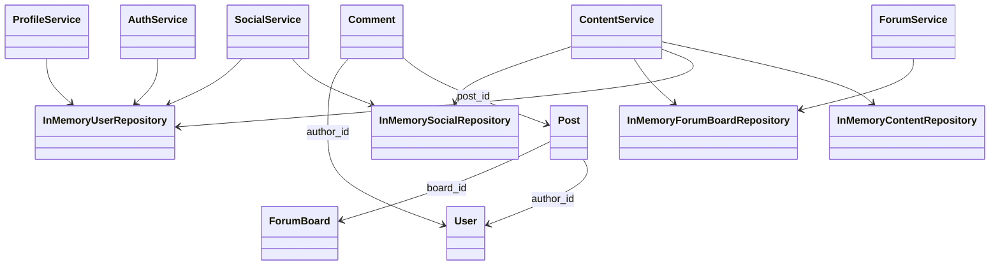

# 股票基金投资论坛架构与类设计

## 1. 技术选型

- 后端框架：Flask 3
- 数据校验：Pydantic 2
- 运行形态：RESTful API + JSON
- 当前存储：内存仓储（便于课程阶段快速迭代）
- 持久化方案：MySQL 8（见 `backend/sql/schema.sql`）

## 2. 分层架构

系统采用分层结构：

1. `api`：接收请求、参数校验、响应封装；
2. `services`：核心业务逻辑（注册认证、帖子、互动、关注等）；
3. `repositories`：数据访问（当前为 InMemory，实现可替换）；
4. `models`：领域模型（User、ForumBoard、Post、Comment 等）；
5. `schemas`：Pydantic 请求/响应模型。

## 3. 关键模块

### 3.1 用户与认证模块

- `AuthService`：注册、登录、基础认证、实名/专业认证流程。
- `ProfileService`：资料维护、投资偏好、隐私设置。
- `SuitabilityService + UserService`：风险问卷与结果计算。

### 3.2 内容模块（新增）

- `ContentService`：帖子发布、更新、列表、详情、评论、点赞、收藏、热榜、搜索建议。
- `InMemoryContentRepository`：维护帖子、评论、点赞集合、收藏集合，计算互动指标。

### 3.3 社交模块（新增）

- `SocialService`：关注/取关、粉丝列表、关注统计。
- `InMemorySocialRepository`：维护关注关系与关注时间。

### 3.4 论坛板块模块

- `ForumService`：板块分类聚合、板块 CRUD。
- `InMemoryForumBoardRepository`：内置默认板块种子数据。

## 4. 核心类关系（简化）

## 5. 关键设计决策

1. 仓储可替换：服务层不直接依赖数据库实现，便于后续切换 MySQL/ORM。
2. 统一响应结构：`{code, message, data}`，便于前端和测试统一处理。
3. 认证方式：Bearer Token，按请求头解析当前用户。
4. 热度计算：`点赞*2 + 收藏*3 + 评论*1`，用于热榜排序。
5. 隐私可见性：通过 `Visibility(public/followers/private)` 控制公开资料字段。

## 6. 迭代边界说明

以下能力已预留扩展点，但本阶段未接入真实三方服务：

- 短信/邮箱验证码网关
- 微信/微博 OAuth
- OCR + 实名 KYC + 人脸活体
- 专业认证反欺诈与人工审核队列
