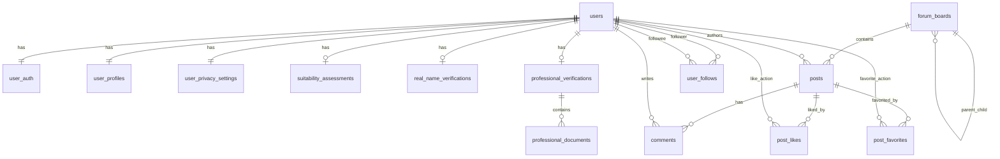

# 数据库设计文档（模块2/3交付）

## 1. 设计说明

当前后端运行使用内存仓储，数据库设计用于部署阶段落库。  
SQL 脚本位置：`backend/sql/schema.sql`（MySQL 8.x）。

## 2. 核心实体

1. 用户域：`users` `user_auth` `user_profiles` `user_privacy_settings`
2. 认证域：`real_name_verifications` `professional_verifications` `professional_documents`
3. 风险评估：`suitability_assessments`
4. 论坛板块：`forum_boards`
5. 内容域：`posts` `comments`
6. 互动关系：`post_likes` `post_favorites` `user_follows`

## 3. 关键字段

### 3.1 users

- `id`：用户主键（UUID 字符串）
- `register_method`：注册方式（phone/email/wechat/weibo）
- `created_at` / `updated_at`

### 3.2 forum_boards

- `slug`：板块唯一标识
- `category`：`market/topic/company_research/qa`
- `parent_id`：父板块（支持树状结构）
- `sort_order`：排序权重

### 3.3 posts

- `board_id`：所属板块
- `author_id`：作者用户ID
- `title` / `content`
- `post_type`：`normal/longform/realtime`
- `stock_codes`：股票代码数组（JSON）

### 3.4 comments

- `post_id`：所属帖子
- `author_id`：评论用户
- `parent_comment_id`：父评论（楼中楼）

### 3.5 post_likes / post_favorites

- 联合主键：`(post_id, user_id)`
- 保证同一用户对同一帖子仅一条点赞/收藏记录

### 3.6 user_follows

- 联合主键：`(follower_id, followee_id)`
- 记录关注关系与关注时间

## 4. 关系模型（简化）

## 5. 索引策略

1. `forum_boards(category, sort_order)`：板块页排序查询
2. `posts(board_id, created_at)`：板块帖子时间流
3. `posts FULLTEXT(title, content)`：全文搜索基础
4. `comments(post_id, created_at)`：评论分页
5. `user_follows(followee_id)`：粉丝列表查询

## 6. 与当前代码映射

1. `app/models/user.py` 对应用户/认证/偏好/隐私实体
2. `app/models/forum.py` 对应板块实体
3. `app/models/content.py` 对应帖子与评论实体
4. `app/repositories/*` 为内存实现，后续可按该文档替换为数据库实现
