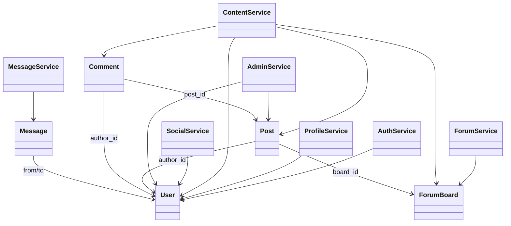

# 架构与类设计

## 1. 技术选型

| 层次 | 技术 | 说明 |
| --- | --- | --- |
| 前端 | Vue 3、Vite、Vue Router | 实现页面、路由、状态和接口调用 |
| 后端 | Flask 3 | 提供 RESTful API |
| 数据校验 | Pydantic 2 | 约束请求和响应结构 |
| 数据存储 | SQLite、SQL脚本兼容 MySQL 8 | 当前本地运行使用 SQLite，`backend/sql/schema.sql` 提供 MySQL 建表脚本 |
| 测试 | unittest | 后端接口级自动化测试 |

## 2. 分层架构

系统采用前后端分离和后端分层架构：

1. `frontend/src/views`：页面层，包含首页、板块页、帖子详情、个人中心、后台页面。
2. `frontend/src/components`：通用组件层，包含导航、帖子卡片、评论、空状态、加载和错误提示。
3. `frontend/src/utils/api.js`：前端 API 封装层，统一处理请求和 token。
4. `backend/app/api`：接口层，负责路由注册、参数接收、统一错误处理。
5. `backend/app/services`：业务层，负责认证、内容、社交、私信、后台管理等业务规则。
6. `backend/app/repositories`：数据访问层，屏蔽 SQLite 读写细节。
7. `backend/app/models`：领域模型层，描述 User、Post、Comment、ForumBoard 等核心对象。
8. `backend/app/schemas`：请求和响应模型层，保证接口数据格式稳定。

## 3. 核心模块

| 模块 | 主要类或文件 | 职责 |
| --- | --- | --- |
| 用户认证 | `AuthService`、`UserRepository`、`TokenRepository` | 注册、登录、token 管理、基础认证 |
| 个人资料 | `ProfileService` | 用户资料、投资偏好、隐私设置 |
| 适当性评估 | `SuitabilityService` | 风险问卷、分数计算和风险等级 |
| 论坛板块 | `ForumService`、`ForumRepository` | 板块分区、板块 CRUD |
| 内容系统 | `ContentService`、`ContentRepository` | 发帖、评论、点赞、收藏、热榜、搜索 |
| 社交系统 | `SocialService`、`SocialRepository` | 关注、取关、粉丝、关注统计 |
| 私信系统 | `MessageService`、`MessageRepository` | 发送私信、会话列表、未读数 |
| 后台管理 | `AdminService` | 内容审核、用户处理、论坛统计 |

## 4. 类关系说明

## 5. 关键设计决策

1. 后端服务层不直接暴露数据库细节，便于从 SQLite 切换到 MySQL 或 ORM。
2. 接口统一使用 `{code, message, data}` 响应结构，便于前端处理和测试断言。
3. 用户认证采用 Bearer Token，所有受保护接口从请求头解析当前用户。
4. 点赞、收藏、关注使用联合唯一关系，避免重复状态。
5. 热榜使用互动指标计算，适合课程设计阶段快速实现和解释。
6. 后台管理以审核状态和用户状态为核心，覆盖内容治理基本闭环。

## 6. AI辅助设计迭代

AI 初稿给出了典型 MVC 结构，但直接耦合数据库操作，不利于测试和替换存储。人工评审后改为 API、Service、Repository、Model、Schema 分层结构，并增加统一响应、统一异常处理和接口测试边界。
