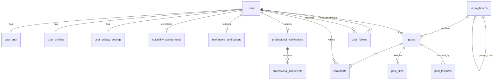

# 数据库设计

## 1. 设计目标

数据库设计围绕股票基金投资论坛的核心业务实体展开，要求支持用户注册认证、个人资料、风险评估、论坛板块、帖子评论、点赞收藏、关注关系、私信和后台治理。

当前项目本地运行使用 SQLite 持久化，数据库文件默认位于 `backend/data/soft_resign.sqlite3`。同时提供 `backend/sql/schema.sql` 作为 MySQL 8 建表脚本，便于部署到关系型数据库。

## 2. 核心实体

| 领域 | 表或实体 | 说明 |
| --- | --- | --- |
| 用户 | `users` | 用户基础记录 |
| 认证 | `user_auth` | 手机、邮箱、第三方账号、密码哈希 |
| 资料 | `user_profiles` | 昵称、头像、简介、投资经验、关注市场 |
| 隐私 | `user_privacy_settings` | 资料可见性设置 |
| 实名认证 | `real_name_verifications` | 身份信息和审核状态 |
| 专业认证 | `professional_verifications`、`professional_documents` | 专业证明和审核状态 |
| 风险评估 | `suitability_assessments` | 问卷答案、分数、风险等级 |
| 板块 | `forum_boards` | 分区、市场、主题和层级结构 |
| 内容 | `posts`、`comments` | 帖子和楼中楼评论 |
| 互动 | `post_likes`、`post_favorites` | 点赞和收藏关系 |
| 社交 | `user_follows` | 关注和粉丝关系 |
| 私信 | 消息仓储对应消息记录 | 发送方、接收方、内容、已读状态 |

## 3. 关键字段

### 3.1 用户与认证

- `users.id`：UUID 字符串主键。
- `users.register_method`：注册方式，支持 phone、email、wechat、weibo。
- `user_auth.phone/email`：唯一约束，避免重复注册。
- `user_profiles.focus_markets`：JSON 数组，保存 A股、港股、美股、基金等偏好。

### 3.2 板块与内容

- `forum_boards.slug`：板块唯一标识。
- `forum_boards.category`：分区类型，包括 market、topic、company_research、qa。
- `posts.board_id`：帖子所属板块。
- `posts.author_id`：帖子作者。
- `posts.stock_codes`：股票代码数组，支持股票检索。
- `comments.parent_comment_id`：支持楼中楼回复。

### 3.3 互动与社交

- `post_likes(post_id, user_id)`：联合主键，保证同一用户对同一帖子只有一个点赞状态。
- `post_favorites(post_id, user_id)`：联合主键，保证收藏状态唯一。
- `user_follows(follower_id, followee_id)`：联合主键，保证关注关系唯一。

## 4. ER关系

## 5. 索引策略

1. `forum_boards(category, sort_order)`：提高板块分区和排序查询性能。
2. `posts(board_id, created_at)`：支持板块帖子列表按时间查询。
3. `posts FULLTEXT(title, content)`：支持 MySQL 下全文搜索。
4. `comments(post_id, created_at)`：支持帖子详情页评论分页。
5. `user_follows(followee_id)`：支持粉丝列表查询。

## 6. AI辅助设计迭代

AI 初稿遗漏了点赞、收藏、关注关系的联合主键，容易产生重复数据。人工复核后将这些关系表改为联合主键，并为板块、帖子、评论、粉丝查询补充索引。
